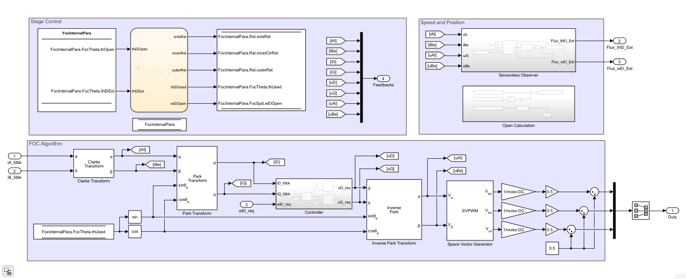
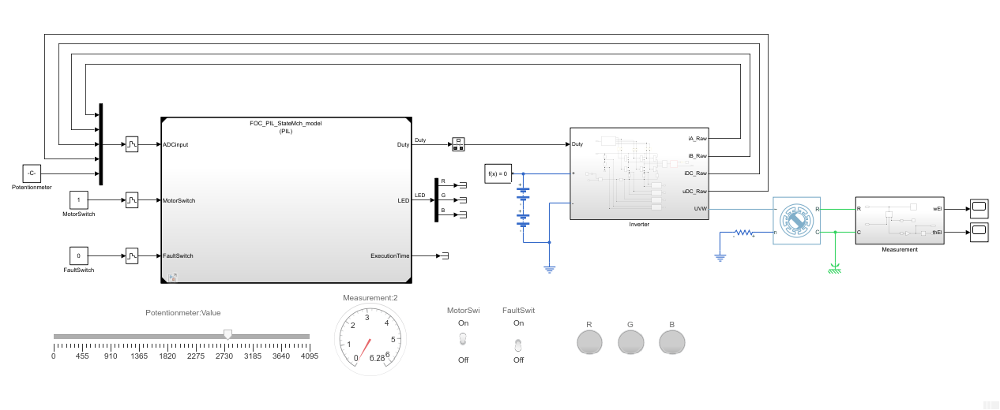

# autoMBD: Motor Control

## 项目描述
AMBD-MC（autoMBD Motor Control project）是autoMBD的第一个开源项目，该项目基于MBD（Model-Based Design，基于模型的设计）实现电机控制框架。    

仓库中包含BLDC/PMSM控制算法的MBD模型，分别实现了六步换相算法和矢量控制（FOC）算法。模型在NXP的电机开发套件平台上，实现了PIL（处理器在环）验证、HIL（硬件在环）验证。

## 仓库结构
* FreeMASTER_Prjct/
    * BLDC_Ctrl_MBD.pmpx
    * FOC_Cctrl_MBD_Integration.pmpx 
    * FOC_Ctrl_MBD.pmpx
* MBD_Models/
    * BLDC_Ctrl_MBD/
        * BLDC_Ctrl_MBD.slx
        * struct_BLDC_Crtl.mat
    * FOC_basic/
        * FOC_basic.m
        * FOC_basic1_OrientedCtrl.slx
        * FOC_basic2_VoltageCtrl.slx
        * FOC_basic3_CurrentCtrl.slx
        * FOC_basic4_CurrentCtrl_SVPWM.slx
        * FOC_basic5_SpeedCtrl.slx
    * FOC_Ctrl_MBD/
        * FOC_Config.m
        * FOC_Ctrl_CodeModel.slx
        * FOC_Ctrl_MBD.slx
        * FOC_PIL_Algth_model.slx
        * FOC_PIL_Algth_top.slx
        * FOC_PIL_StateMch_model.slx
        * FOC_PIL_StateMch_top.slx
        * FOC_Sub_CoreAlgoithm.slx
        * FOC_Sub_StateMch.slx
        * struct_FOC_Crtl.mat
* Record_Pictures/
* S32DS_Prjct/
    * BLDC_Ctrl_MBD_DS/
    * FOC_Ctrl_MBD_Integration/

## BLDC模型
基于MBD电机控制框架，实现了BLDC六步换相算法。
* BLDC完整模型预览

* BLDC运行结果预览

## PMSM模型
基于MBD电机控制框架，实现了FOC无感算法。
* FOC算法模型预览

* PIL测试模型预览

* 运行结果预览

